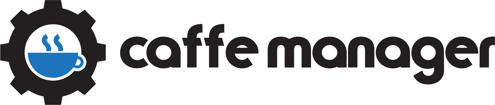

<br><br>

App that makes managing a caffe/restaurant/shop/warehouse easier.

### Node.js, Express, MongoDB, Vue.js, Electron

## First

### Make sure you have [NodeJS](https://nodejs.org/en/) and [MongoDB](https://www.mongodb.com/) installed locally.

## How to run

### Linux (not tested on MacOS)
1. Clone - `git clone https://github.com/skinnn/caffe-manager.git` or download the repo
2. Run `npm run install-deps` command in the **root** folder to install all the dependencies
3. In the first terminal (from the **root** folder) start the server with `npm run server`
4. In the second terminal (from the **root** folder) start the client with `npm run client`

:tada: :fireworks:

## Run Alternatively

1. After installing all the dependencies, in the first terminal inside the **client** folder you can run `npm run dev` to start the client
2. In the second terminal inside the **server** folder you can run `npm run dev` to start the server

- Client default port: 9080
- Server default port: 9090

### Windows
1. After you install all the dependencies with `npm run install-deps` you need to change dev and lint scripts in **package.json** file in the **server** folder, so linting can work. It should look like this:

```json
"scripts": {
  "start": "node src/app.js",
  "dev": "nodemon src/app.js --exec \"npm run lint && node\"",
  "lint": "eslint src/**/*.js"
}
```

2. From the **root** folder, you can start the server with `npm start server` and client `npm start client` command


## License

MIT - see [LICENSE](LICENSE)
